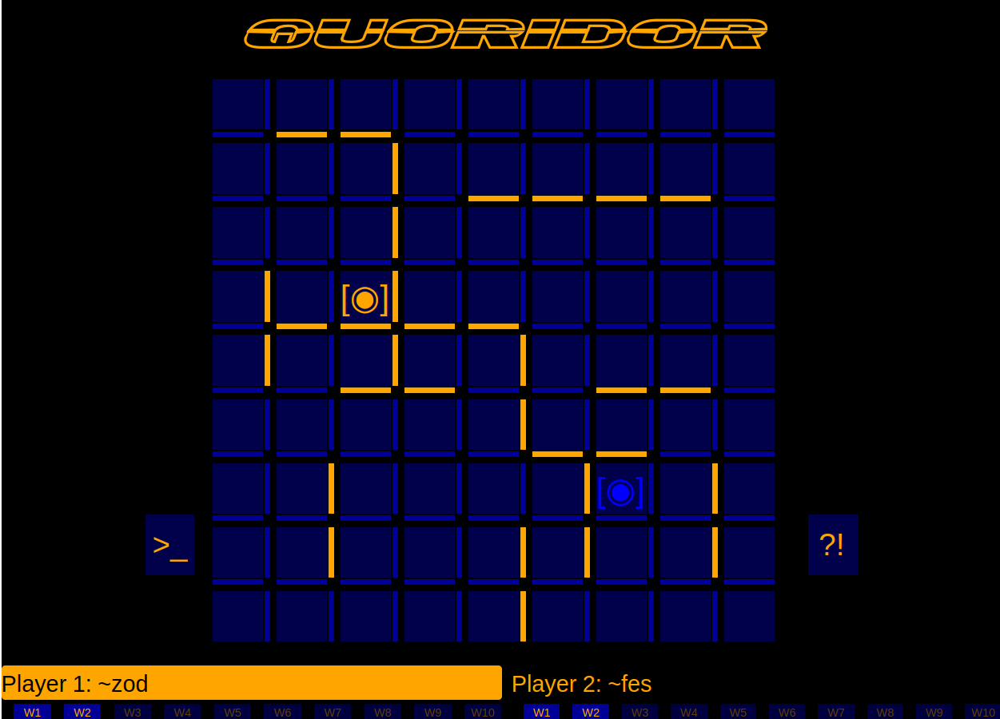

### Quoridor: On Urbit

Quoridor is a simple game with walls, and pawns, that gives rise to a surprising level of complexity. The goal is simply to reach the other side of the board before your opponent does.  A player that appears to be winning can suddenly be thrown into a losing position from the placement of one single wall.  

This was my app submission for the Assembly Hackathon 2023. It was not submitted for the Hackathon, as it was not finished in time.  The project started as a clone of the [%Echo App](https://github.com/hoon-school/app-school-2023.8/blob/master/aa4.md).  My development strategy was to enact a "Ship-of-Theseus" - where the %Echo app was slowly transformed into the %Quoridor App over a period of 3 months. As of December 2023, it has reached its 'Miniumum Viable Product' stage, and is basically playable.

Currently, the app is a desk that is run between two fake zods. It has/demonstrates the follwoing features:

- React, jQuery and @urbit/http-api front-end, Gall app for the back-end.
- Back-end logic is primarily implemented in the *++on-agent, ++on-poke and ++on-watch arms* of the Gall App.
- Standard *Action-Update* logic is used to send json messages from FE -> Eyre -> Gall and back.
- One player (~zod) can send a request to another player (~fes) to start a game. The two BE clients performs a subscription handshake, and game setup.
- Players take turns, and can either move their pawn, or place a wall on the board.
- UI is fully functional, and reflects the current game state after every move (which includes player position, all walls placed, whose turn it is, and number of walls remaining).

The project has been halted, as significant portions of the FE would need to be re-written to extend the application.

A screenshot of a game between two fakezods, can be seen below:



### Lessons Learned:

This is the first urbit app I have built - so a lot of unexpected twists and turns occured.   Coding a Gall App is *not* like coding a normal Node.js or LAMP project that one would attempt. 

Here are some things I would do differently, for the future:

*1) Integrating jQuery with React was an unpleasant experience, and fraught with issues.*

This ate up a lot of my hackathon time. The urbit react template project uses Rollup as its code packager, and structuring files/imports properly can be a tedious experience. I encountered many *(Void 0) and Reference Errors* over a three month period.

Debugging minified and packaged code is also difficult, as functions are anonymised in the inspection console. This slows down debugging, relegating the process to identifying the shape of functions, and using lots of print statements.

It is **possible** to change the underlying parameters for Rollup, to perhaps alleviate these issues. But this requires advanced knowledge of Node compiliation and project structuring. 

*2) jQuery was a quick and dirty solution to get a UI up and running, but incurred technical debt later on.*

In retrospect, I should have just learned the various React hooks and lifecycle, and worked within the bounds of react. It would have been much easier to modularize my code. 
Currently, the jQuery code being used is half in an external file, and half in the app.jsx file of the app.

*3)  This experience has rekindled my skepticism of complicated proprietary frameworks (i.e: React), and choose simpler frameworks and UIs.*

Underneath the React framework is 10+ years of Node.js packages and technologies. Anyone that looks in the */node_modules* folder of an Urbit React project can see the enormous number of dependences.  Even for advanced user, it is a blackbox.

So I am no longer reluctant to learn Sail or Rudder.

### Getting It Running:

To get %Quoridor running for two fakezods, do the following:


1) Download the Latest Dev Pill:  https://bootstrap.urbit.org/dev-latest.pill

2) Download the latest urbit binary: 
`curl -L https://urbit.org/install/linux-x86_64/latest | tar xzk --transform='s/.*/urbit/g' && ./urbit`

3) Run the following commands:

```
urbit -B dev-latest.pill -F zod
```

Do this for both ~zod and ~fes.

4) Run both ships in separate terminals. Type the following commands, to bring up a new desk on mars (inside urbit):

```
|new-desk %quoridor
|mount %quoridor
```

5) Copy /quoridor/desk/* folder into your /zod/quoridor folder. Do this for both fakezods.

6) Now run the following commands:

```
|commit %quoridor
|install our %quoridor
```

The urbit console should report that the app has been successfully installed (or has been "bumped")

7) Next we need to get the UI running. Each fakezod should have reported a Landscape URL in its console (is most likely localhost:8080 and localhost:8081 for our two fakezods). Type `+code` into each fakezod console, and use the code to login to Landscape for each of the fakezods.

8) We now need to build our React front-end. Navigate to the /quoridor/ui folder, and type the following commands:

```
npm install
npm run build
```

a /dist folder should appear. We will use this folder for the next step.

9) You should be in Landscape, and see a drab looking %quoridor tile.  Enter the following URL for each of the Landscape tabs:  localhost:80<whatever>/docket/upload.  For each of your Landscape tabs:

-  Select the /dist folder we generated in Step 8.
- Hit the "Glob It!" button.

*Warning/Note:*  There should be *6 files* that are uploaded. If the docket uploader reports 8000+ files, you accidentally selected the /node_modules folder, or the root folder by mistake (!!)


Now click on the %quoridor App tile for each of the two Landscape tabs. 

The app should be running.

